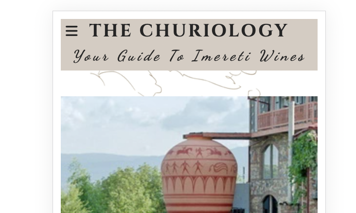

# The Churiology Website

The Churiology is designed to be a responsive website allowing visitors to view it on a range of devices. The site is targeted toward wine enthusiasts who are looking for more in-depth information on Georgian wine regions. Along with wine origins, The Churiology focuses solely on the Imereti region, providing ample information on thousands of years old unique western Georgian winemaking methods, local grape varieties and must-visit wineries. 

 

[View The Churiology on Github Pages](https://liakintsurashvili.github.io/The-Churiology/index.html)

## User Experience (UX)

### **Purpose**

The Churiology has been created as a fictional website to complete the first milestone project as part of the Code Institute's Full Stack Software Development course. It developed as an idea to popularize the lesser-known Georgian wine region, Imereti.

The site has been built with a mobile-first responsive design, keeping the needs of the user at the forefront of the design process.

## User Stories

### First Time Visitor Goals:

* As a first-time visitor, I want to easily understand the main purpose of the site.
* As a first-time visitor, I want to be able to easily navigate through the website, to find the content.
* As a first-time visitor, I want to be able to view the site on a range of device sizes.

### Returning Visitor Goals:

* As a Returning Visitor, I want to find up-to-date information on recommended vineyards.
* As a Returning Visitor, I want to find frequently updated content with increased varieties of grapes and wine-making technologies.

### Frequent Visitor Goals:

* As a Frequent User, I want to be able to recommend new wineries and vineyards that could be featured on a website.
* As a Frequent User, I want to see more in-depth information added to wineries with better imagery and location pins.
* As a Frequent User, I want to see information on the upcoming wine-related events in the local area.

## Design

### Color Scheme

This website uses a palette of creame colors to create a simple, aesthetically pleasing palette. The palette was generated by [Coolors](https://coolors.co/) website.

### Typography

[Google Fonts](https://fonts.google.com/) was used to source the font styles used throughout the website:

* Cinzel: Used for logo and headings
* Noto Serif: Used for the main page sections
* Dancing Script: Used for span paragraphs

### Imagery

Images found on the Homepage, Grape Varieties page, Wineries page and Form page were stock photos downloaded from [Shutterstock](https://https://www.shutterstock.com//). They were chosen to be relevant to the content of the webpage.

Icons used in the footer were imported through [Font Awesome](https://fontawesome.com/).
A custom-made favicon was also created through **Font Awesome**

### Wireframes

[Balsamiq Wireframing Software](https://balsamiq.com/) was used to create the wireframes. 

#### Home Page

- [Mobile Screen](documentation/homepage-mobile.png)
- [Desktop Screen](documentation/homepage-desktop.png)

#### Grapevarieties Page

- [Mobile Screens](documentation/grapevarieties-mobile.png)
- [Desktop Screen](documentation/homepage-desktop.png)

#### Wineries Page

- [Mobile Screens](documentation/wineries-mobile.png)
- [Desktop Screen](documentation/grapevarieties-desktop.png)

#### Form Page 

- [All devices](documentation/form-page.png)

#### Response Page

- [All devices](documentation/response-page.png)

## Features

### Existing Features

The Churiology has 4 main pages accessible to the user: the homepage, Grape Variety page, Wineries page and Form page. There is also a Response page which only shows on submission of the sign-up form.

**All** pages include the following features:

- Header with logo and tagline: The logo appears at the top of each page followed by a tagline underneath. When the user scrolls down the page they do not remain fixed to ensure the maximum amount of screen space is utilized by content.

- Navigation: The navigation menu is presented as a hamburger at the top left corner of the page on mobile devices while fitting just underneath the tagline for larger screens.

Navigation allows users to easily move through the different pages of the website. Although Sticky positioning has not been used since it did not look optimal from a design point of view, the Quick Links section has been added to the footer instead to ensure a good user experience across all devices.

- Footer: The footer contains three sections.

 **Social Media** section including universally recognized icons for social media; Twitter, Facebook and Instagram.

 **Quick Links** section with navigation links to all four pages.

 **Contact Us** section with email for the website.

### Home Page

### Grape Varieties Page

### Wineries Page

### Form Page

### Response Page

### Accessibility

### Technologies

## Version Control

## Testing

## Lighthouse

## Validator testing

### bugs

## Credits

### Resources

### Acknowledgments