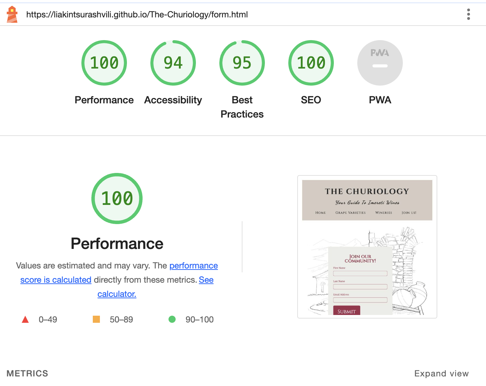

# The Churiology Website

The Churiology is designed to be a responsive website allowing visitors to view it on a range of devices. The site is targeted toward wine enthusiasts who are looking for more in-depth information on Georgian wine regions. Along with wine origins, The Churiology focuses solely on the Imereti region, providing ample information on thousands of years old unique western Georgian winemaking methods, local grape varieties and must-visit wineries. 

 

[View The Churiology on Github Pages](https://liakintsurashvili.github.io/The-Churiology/index.html)

## User Experience (UX)

### **Purpose**

The Churiology has been created as a fictional website to complete the first milestone project as part of the Code Institute's Full Stack Software Development course. It developed as an idea to popularize the lesser-known Georgian wine region, Imereti.

The site has been built with a mobile-first responsive design, keeping the needs of the user at the forefront of the design process.

## User Stories

### First Time Visitor Goals:

* As a first-time visitor, I want to easily understand the main purpose of the site.
* As a first-time visitor, I want to be able to easily navigate through the website, to find the content.
* As a first-time visitor, I want to be able to view the site on a range of device sizes.

### Returning Visitor Goals:

* As a Returning Visitor, I want to find up-to-date information on local wineries and wine-making technologies implemented in the region.

### Frequent Visitor Goals:

* As a Frequent User, I want to be able to recommend new wineries and vineyards that could be featured on a website.
* As a Frequent User, I want to be notified of content updates.

## Design

### Color Scheme

This website uses a palette of creame colors to create a simple, aesthetically pleasing palette. The palette was generated by [Coolors](https://coolors.co/) website.

### Typography

[Google Fonts](https://fonts.google.com/) was used to source the font styles used throughout the website:

* Cinzel: Used for logo and headings
* Noto Serif: Used for the main page sections
* Dancing Script: Used for span paragraphs

### Imagery

Images found on the Homepage, Grape Varieties page, Wineries page and Form page were stock photos downloaded from [Shutterstock](https://https://www.shutterstock.com//). They were chosen to be relevant to the content of the webpage.

Icons used in the footer were imported through [Font Awesome](https://fontawesome.com/).
A custom-made favicon was also created through **Font Awesome**

### Wireframes

[Balsamiq Wireframing Software](https://balsamiq.com/) was used to create the wireframes. 

#### Home Page

- [Mobile Screen](documentation/homepage-mobile.png)
- [Desktop Screen](documentation/homepage-desktop.png)

#### Grapevarieties Page

- [Mobile Screens](documentation/grapevarieties-mobile.png)
- [Desktop Screen](documentation/homepage-desktop.png)

#### Wineries Page

- [Mobile Screens](documentation/wineries-mobile.png)
- [Desktop Screen](documentation/grapevarieties-desktop.png)

#### Join Us Page 

- [All devices](documentation/form-page.png)

#### Response Page

- [All devices](documentation/response-page.png)

## Features

### Existing Features

The Churiology has four main pages accessible to the user: the homepage, Grape Variety page, Wineries page and Join Us page. There is also a Response page which only shows on submission of the sign-up form.

**All pages include the following features**:

- **Header with logo and tagline**: The logo appears at the top of each page followed by a tagline underneath. When the user scrolls down the page they do not remain fixed to ensure the maximum amount of screen space is utilized by content.

- **Navigation**: The navigation menu is presented as a hamburger at the top left corner of the page on mobile devices while fitting just underneath the tagline for larger screens.

Navigation allows users to easily move through the different pages of the website. Although Sticky positioning has not been used since it did not look optimal from a design point of view, the Quick Links section has been added to the footer instead to ensure a good user experience across all devices.

- **Footer**: The footer contains three sections.

 ***Social Media*** section including universally recognized icons for social media; Twitter, Facebook and Instagram.

 ***Quick Links*** section with navigation links to all four pages.

 ***Contact Us*** section with email for the website.

### Home Page

The homepage has a simple layout split into sections with the help of imagery and background colors. These sections take the user on a clear journey as to what to expect from the website. Each section has relevant media content and styling elements that separate the information into a format that flows, with responsive design. The home page also includes a Sign-up section with an explicit message for the visitors of the website to join the list of a monthly newsletter with the subscribe button that directs to the Join Us! page.

### Grape Varieties Page

The grape Varieties page is split into four sections. The top section contains a brief overview of Imereti Wine Region. The middle section contains two smaller sections of White and Red local grape varieties each containing six smaller boxes of content. This layout was achieved with flexbox styling attributes and @media queries to make a responsive aesthetically appealing design. The lowest section on the page consists of the Sign-up section.

### Wineries Page

The Wineries page consists of six image and paragraph sections providing information on must-visit wineries in the local area. This responsive layout was achieved using flexbox styles as well as @media queries.The lowest section on the page consists of the Sign-up section.

### Join us! Page

Join Us page consists of a sign-up form with a subscribe button.

### Response Page

Response page consists of a thank you message, that lets a customer know they have successfully subscribed to the monthly newsletter.

### Accessibility

To ensure that the website is as accessible friendly as possible following steps have been taken:

- The use of semantic HTML.
- The use of descriptive alt attributes on images on the site.
- Contrasting color scheme throughout.
- Marking the current page as Active to make the menu accessible.

### Technologies
- VS Code - Used to write and edit code.
- Balsamiq - Used to create wireframes.
- Git - For version control.
- Github - To save and store the files for the website.
- Google Fonts - To import the fonts used on the website.
- Font Awesome - For the iconography on the website.
- Google Dev Tools - To troubleshoot and test features.
- Favicon- To create favicon
- Am I Responsive - To show the website image on a range of devices.
- Coolors- For color palette picking.
- Shutterstock - For stock images.

## Deployment

### Deployment to GitHub Pages

- The site was deployed to GitHub pages. The steps to deploy are as follows: 
 - In the [GitHub repository](https://github.com/Liakintsurashvili/The-Churiology), navigate to the Settings tab 
 - From the source section drop-down menu, select the **Main** Branch, then click "Save".
  - The page will be automatically refreshed with a detailed ribbon display to indicate the successful deployment.

  The live link can be found [here](https://liakintsurashvili.github.io/The-Churiology/)

## Version Control

Version control has been maintained using Git. The code written for this website has been updated via regular commits to Github.

Commit History can be viewed [here](https://github.com/Liakintsurashvili/The-Churiology/commits)

## Testing

## Compatibility
- The website was tested on the following browsers: Chrome, Firefox, Internet Explorer, and Safari.

## Responsiveness

- The website was checked by dev tools implemented in Chrome.

## Lighthouse

- Using lighthouse in devtools I confirmed that the website is performing well.

### Home Page

### Grape Varieties Page

### Wineries Page 

### Join Us Page

### Response Page

 

## Validator testing

### HTML

### Home Page

   - No errors or warnings were found when passing through the official W3C validator.

  [Home Page Validator](documentation/w3-validator-home-page.png)

### Grape Varieties Page

  - No errors or warnings were found when passing through the official W3C validator.

  

### Wineries Page 

  - No errors or warnings were found when passing through the official W3C validator.

  

### Join Us Page

  - No errors or warnings were found when passing through the official W3C validator.

  

### Response Page

  - No errors or warnings were found when passing through the official W3C validator.

  

### CSS 

  No errors or warnings were found when passing through the official W3C (Jigsaw) validator.

  

### bugs

- Lighthouse Performance was low due to images I resized and converted images to webp files.
- Added Aria-label on anchor elements.
- Fixed the YouTube video alignment.

## Future improvements

- Add custom 404 page.
- Improve the quality of the commit messages.
- Use JavaScript to create a hamburger menu for the navigation bar on smaller devices.
- Look at replacing fixed background-image with a different styling option, since it's not supported on ios mobile devices.
- Make separate pages for each winery with more media content, opening times and Google Maps locations.

## Credits

### Resources
- [Code Institute]() HTML and CSS learning content and for providing the [template]() used to start this website.
- [W3Schools](https://www.w3schools.com/) For general tips and advice on a variety of HTML and CSS.
- [Kera Cudmore](https://github.com/kera-cudmore) for README guides.
- [Kevin Powell](https://www.youtube.com/user/KepowOb) for Footer inspiration.

### Acknowledgments

- [Iuliia Konovalova](https://github.com/IuliiaKonovalova) Massive thank you to my mentor for guiding me through this whole process with invaluable advices, patience and support.
- [Kevin Powell](https://www.youtube.com/user/KepowOb) for his amazing CSS tutorials.
- [Code Institute](https://codeinstitute.net/) Slack community members for their support and help.
- [Kera Cudmore](https://github.com/kera-cudmore) for all of her excellent advice on creating README.
